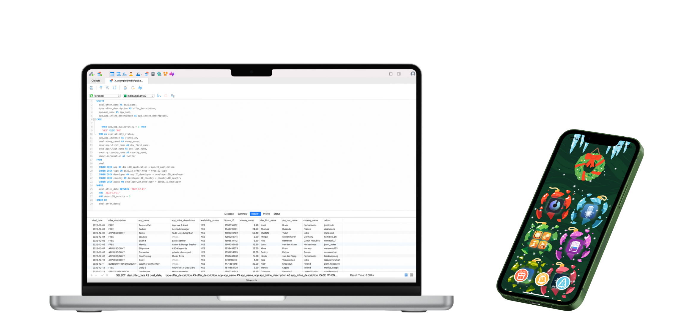
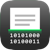
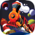
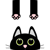
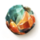
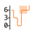

<h1 align="center">INDIE APP SANTA</h1>

	I initiated this repository in 2022 (see the <a href="legacy/readme.md">legacy version</a>) to archive the Indie App Santa event, <b>a fantastic initiative</b> for independent developers. Now, you can explore and query various data related to this event. It's a great opportunity for indie developers to emerge and for users to discover new and exciting apps. <b>François Boulais</b>, an indie developer himself, is behind this event. Connect with him on <a href="https://twitter.com/frboulais">Twitter!</a>
 
 
While the database isn't superb and may have some missing data, I hope that, with the support of this community, <b>we can</b> collaboratively fill in the NULL values!

 

 

> [!IMPORTANT]
> This repository has nothing to do with Indie App Santa!

 

> [!IMPORTANT] 
> This database may have some inaccurate data!

 
<h2 align="center">APPS SEEN</h2>	

 	

